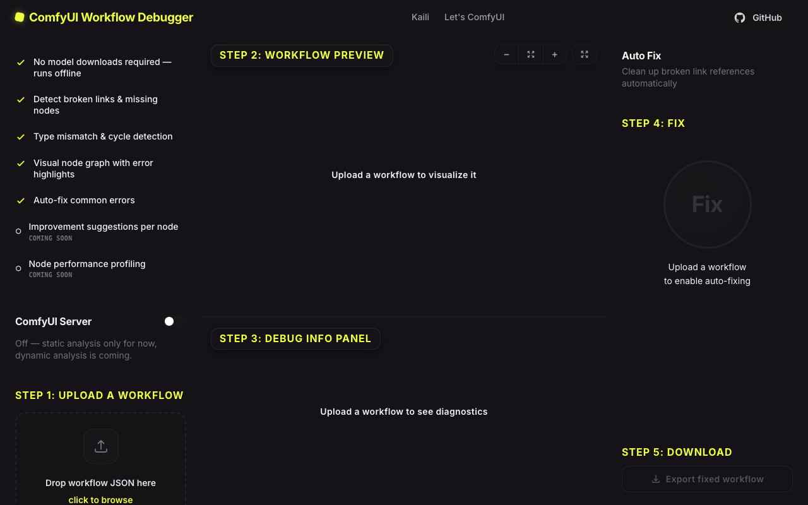
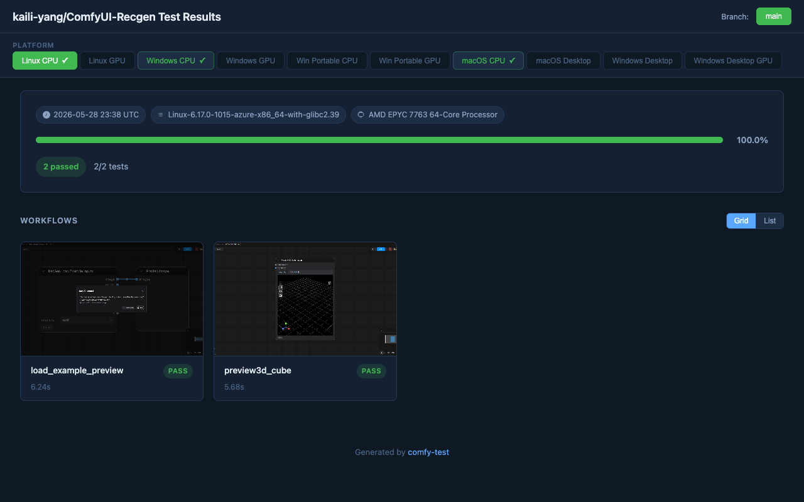

# Kaili Yang

🏛️ Architect · 🤖 AI Developer · ✍️ Writer

[kaili.space](https://kaili.space) · [GitHub](https://github.com/kaili-yang) · [X](https://x.com/KellyYa75580321)

---

## 🚀 Projects

**[kaili.space](https://kaili.space)** 🌐 — Personal knowledge base with architecture reading notes, ComfyUI docs, and a blog.

**[comfy-workflow-debugger](https://comfy-workflow-debugger.netlify.app/)** 🐛 — Visual debugger for ComfyUI node graphs. Trace data flow and pinpoint errors in 2D/3D AI generation pipelines.

**[ComfyUI-Recgen](https://github.com/kaili-yang/ComfyUI-Recgen)** 🧊 — ComfyUI custom nodes for RecGen: RGB + depth + mask → 3D mesh / Gaussian splat. [Test results ✅](https://kaili.space/ComfyUI-Recgen/#main/linux-cpu)

**[Let's Comfy](https://letscomfy.netlify.app/guides/basic/)** 📖 — Beginner-friendly ComfyUI guide series covering core concepts and practical workflows.

---

## 🛠️ Skills

- 🤖 **AI pipelines** — ComfyUI, Stable Diffusion, 2D/3D generative workflows
- 🏗️ **Architecture** — distributed systems, microservices, ecosystem design from scratch
- 💻 **Frontend** — Next.js, React, TypeScript, Tailwind CSS
- 🚢 **Delivery** — GitHub Actions, open-source contribution

---

## 📬 Stay in the Loop

I ship tools, write about AI workflows, and share what I'm building in public.

Follow along on **[X / Twitter](https://x.com/KellyYa75580321)** — new projects, behind-the-scenes, and the occasional hot take on AI tooling. 🔔

> _If you build with ComfyUI, use my tools, or just vibe with the content — welcome to follow, comment, PR & build with me.
